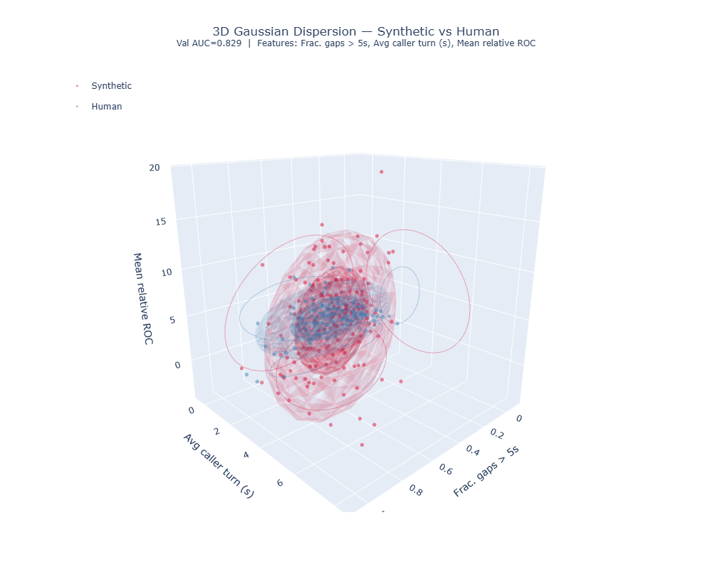
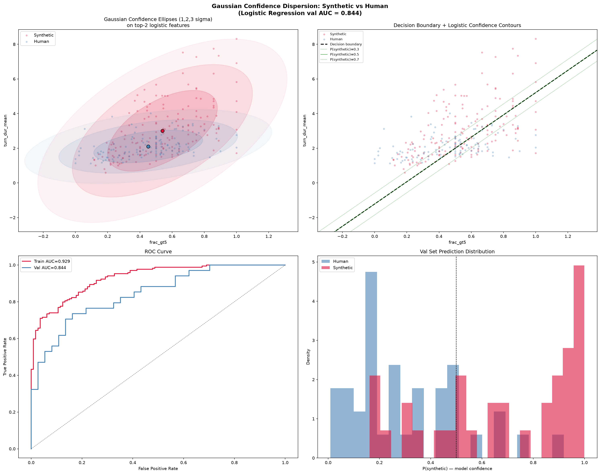

# HackMTY 2026

<h1 align="center">
  
</h1>

<!-- Summary -->
<p align="center">Prodosy - Detecting Synthetic Calls. <i>By La Birriería 94</i></p>

## Table of contents

## Getting started
### Prerequisites
- [Python 3.11](https://www.python.org/downloads/release/python-3110/)
- [Git](https://git-scm.com/downloads)
- [huggingface-cli](https://huggingface.co/docs/huggingface_hub/quick-start)

### Installation

You'll need to clone the repository in order to get the project running, which can be done by running the following command in your terminal:
```sh
git clone --recurse-submodules https://github.com/TEC-Andres/HackMTY-2026.git 
``` 

### Dependencies
From here, you will need to install any and all dependencies from the project, you can do this manually by entering on `/fastapi` and running the following command:
```sh
pip install -r requirements.txt
```

### Dataset
In order to retrieve the dataset, please enter [hackmty26 releases](https://github.com/alturio/hackmty26/releases/tag/v1.0) and download the `altur-challenge-audio.zip` file. Then, extract the contents into root, preferably in a folder called `audio`. The structure should look like this:
```
HackMTY-2026/
├── audio/
│   ├── call_0a9c546208d1.wav
│   ├── call_0ab7d2a0c0f5.wav
│   ├── ...
│   └── call_fff9e3c7f0d1.wav
├── .../
└── README.md
```

### Environment Variables
In order to run the project, you will need to create a `.env` file on root directory and add the following variables. In order to make this easier, you can copy the `.env.example` file and rename it to `.env`.
```
cp .env.example .env
```

### Local Setup
#### Git settings
In order to properly push, you'll need to run the following git script in order to not accidentally screw up with the rulesets.
```sh
git config core.hooksPath .githooks
```
Upon doing this, you will work on any of the issues placed on the [issues](https://github.com/TEC-Andres/HackMTY-2026/issues). You also need to keep an eye on the [Hack-Monterrey](https://github.com/TEC-Andres/Hack-Monterrey) project in order to see what's needed and what can be omitted for now.

## Execute & test
Open two terminals, one located at `/hackmty26/scripts` and another one located at `/fastapi`. In the first terminal, run the following command to start the FastAPI server:

```sh
# /fastapi/
uvicorn app.main:app --port 8000 --reload
```

In the second terminal, run the following command to test the endpoint:
```sh
# /hackmty26/scripts/
python .\check_endpoint.py --url http://127.0.0.1:8000/detect/YOUR-MODEL-NAME --audio-dir ~\HackMTY-2026\audio\
```

If `YOUR-MODEL-NAME` is left in blank, a combination of all the models weighted will be used to detect the audio files. You can also specify a model name to test a specific model.

## Justification of the models
The models used in this project follow a very particular pattern, that is, these are mere regressional models, not actually a prediction model. The reason for this decision is precisely because of the nature of the problem. We were offered a small dataset (353 audio files); training a model in this dataset would just overfit the model making it useless for any other audio file. In the end, we used three different statistical models to analyze the audio files and then combine them into a single model that would give us the best results.

### Time difference & distribution `/detect/timeDiff`

**What does it measure?**
It measures the difference of $t''_i$ for user-0 (the synthetic caller) and compares it against a Gaussian regression. In practice, this means looking at how the response latency of the synthetic user evolves across the conversation and modeling the distribution of those latencies rather than the raw timestamps.

**Why is it done?**
During exploration we found a pattern: the synthetic user takes slightly longer to answer than a human caller would, but above all, the interval between those delays is extremely constant. In other words, $t''_i \approx 0$ for a large portion of the interaction, revealing a machine-like regularity in the response timing. 

<table align="center">
  <tr>
    <td align="center" width="50%">
      
      <br>
      <sub><b>Figure 1:</b> Synthetic vs. Human 3D Gaussian dispersion comparison.</sub>
    </td>
    <td align="center" width="50%">
      
      <br>
      <sub><b>Figure 2:</b> Gaussian confidence score distribution analysis.</sub>
    </td>
  </tr>
</table>

Using this observation, `_playingGround/` built a Gaussian dispersion model that separates the synthetic (bot) data from the human (bonafide) data as cleanly as possible, using the shape and spread of the latency distribution as the discriminating signal. With this approach we reached a **VAL AUC of 0.829** on experimental trials.

### Resonance `/detect/resonance`

**What does it measure?**
It measures 7 physical properties of the voice (formants, pitch, and how they change over time) and uses them to predict whether the audio is human or synthetic. Formants are the spectral peaks that amplify certain frequency bands, and the way they move is a strong fingerprint of the vocal tract.

**How is it measured?**
Using Praat, the formants **F1** and **F2** together with the pitch (**F0**) of the caller channel are tracked frame by frame. From those tracks, 7 numbers are computed that describe how those frequencies move across the whole call. Each metric receives a weight from a logistic regression that automatically learns how much to trust it:

| Metric | Weight | Suspicious when |
| --- | --- | --- |
| `F1_jitter` | 0.83 | high |
| `F0_F1_corr` (pitch–formant correlation) | 0.75 | low |
| `F1_cv` | 0.66 | high |
| `vocoder_periodicity` | 0.63 | high |
| `F1_drift_abs` | 0.62 | low |
| `F2_cv` | 0.61 | low |
| `F2_jitter` | 0.60 | high |

A logistic regression is then trained on top of these features, learning the optimal weight for each one instead of relying on hand-tuned thresholds.

**Results**
Combined result: **AUC 0.94** on calls from people never seen during training, with **82% accuracy**.

<!-- <table align="center">
  <tr>
    <td align="center" width="50%">
      
      <br>
      <sub><b>Figure 3:</b> Logistic regression weight per resonance metric.</sub>
    </td>
    <td align="center" width="50%">
      
      <br>
      <sub><b>Figure 4:</b> ROC curve of the resonance model (AUC 0.94).</sub>
    </td>
  </tr>
</table> -->

### Natural Speech Termination `/detect/NST`

**What does it measure?**
It looks at the subconscious vocal signals a speaker uses to indicate they have finished talking. Humans do not end a turn by simply stopping; they taper off, let their voice go rough, and leave a characteristic noisy tail. Synthetic speech tends to skip these cues.

The following sub-parameters are measured:

- **Abruptness of the volume drop:** the AI cuts the sound far more abruptly.
- **Time to reach silence:** the AI reaches silence almost instantly.
- **Background noise level:** AI call recordings carry a higher and much more erratic background noise floor.
- **Voice clarity at the end:** the AI voice stays artificially crisp until the very last millisecond, whereas human voices become choppy or rough (known as *vocal fry*).
- **Echo delay:** there are slight differences in echo synchronization between human and AI calls.

**How is it measured?**
The caller channel is analyzed frame by frame around the end of each speech turn (detected with VAD). The energy envelope (RMS over 10 ms windows) is used to see how abrupt the cut is and how long it takes to reach the background silence. Pitch/clarity autocorrelation is used to tell whether the tail still sounds "voiced", and an autocorrelation analysis in the 8–60 ms band detects echo/reverberation. This yields **6 numbers per call** that describe *how* the speech ends, not *what* is said.

**The 6 metrics** (value = standardized coefficient of the final model; the sign indicates the real direction of suspicion, not a univariate assumption):

| Metric | Coeff. | Suspicious when | Notes |
| --- | --- | --- | --- |
| `floor_db` | +2.68 | high | Noisier / less silent line between turns → more likely synthetic. **Highest generalization risk of the set:** its correlation with the model output (0.44) is stronger than its real correlation with the true label (0.21). Documented but unresolved. |
| `abruptness_db_mean` | +2.59 | high | Sharper energy drop right at the end of the turn. |
| `voiced_frac_near_end_range` | −0.85 | low | Little variation in "how voiced" the tail is across the different turns of the call; humans vary far more from turn to turn. |
| `tail_ms_mean` | −1.00 | low | Reaches silence almost instantly after finishing speaking. |
| `echo_delay_ms_mean` | +0.80 | high | Larger echo/reverberation delay. |
| `voiced_frac_near_end_mean` | −0.79 | low | Lower according to the joint model. **Careful:** in isolation this metric is *higher* in synthetic audio (0.75 vs. 0.66 human), but in the final model — combined with the other 5 — its coefficient flips sign due to correlation with `range`. It is the only one of the 6 with this univariate-vs-model inconsistency, worth mentioning when comparing cards across teams. |

### Acoustic Ensemble `/detect/`
Rather than having three models working independently, we decided to merge them into a single model that would take their accuracy from their training data with their confidence level in order to decide whether an audio is human or synthetic. In order to maximise accuracy, we defined a formula that takes the decision, their accuracy, and their confidence level to give a final score. It surges the following inequality:

$$
\frac{\alpha\cdot\text{conf}_{\alpha}\cdot\text{acc}_{\alpha}}{\alpha+\beta+\gamma} < \frac{(\beta \cdot \text{conf}_{\beta}\cdot\text{acc}_{\beta})+(\gamma \cdot \text{conf}_{\gamma} \cdot \text{acc}_{\gamma})}{\alpha+\beta+\gamma} 
$$

If the inequality is true, then the audio is classified as synthetic, otherwise it is classified as human. Using this principle, we are able to basically get the best of all words, we are able to verify the audio with multiple tests; allowing us to get a better accuracy than any of the models individually.

### Results
The following table shows the accuracy of each model individually and the accuracy of the ensemble model.

| Model Name | Accuracy |
| --- | --- |
| timeDiff | 0.775 |
| resonance | 0.789 |
| NST | 0.831 |
| acousticEnsemble | 0.930 |

> [!NOTE]
> Based upon running the endpoint with `--n 71` and `--audio-dir ~\HackMTY-2026\audio\` on the `check_endpoint.py` script.

Using each individual model, we are able to enscope more variables in order to get a higher accuracy. However, at the end, the ensemble model **will** grant us a better accuracy than any of the models individually, which is the reason why we decided to use it as our main model.

## Team members

| Name | GitHub | Role |
| --- | --- | --- |
| Ethiel Favila | [@efavilaa](https://github.com/efavilaa) | `HRI (NST,ensemble), Integration, Backend & Frontend` |
| Isabel Mejia Franco | [@IsaMejiaF](https://github.com/IsaMejiaF ) | `Frontend & Web Design` |
| Catherine | [catherinegd7](https://github.com/catherinegd7) | `HRI (resonance, ensemble), Integration & Backend` |
| Andrés Rodríguez Cantú | [@TEC-Andres](https://github.com/TEC-Andres) | `HRI (timeDiff, ensemble), Integration & Backend` |

## License
All code in this repository is licensed under the [MIT License](LICENSE). The dataset is licensed under the [CC BY-NC 4.0 License](https://creativecommons.org/licenses/by-nc/4.0/).

<!-- Footer -->
<br>
<div align="center">HackMTY 2026 – La birriería 94</div>